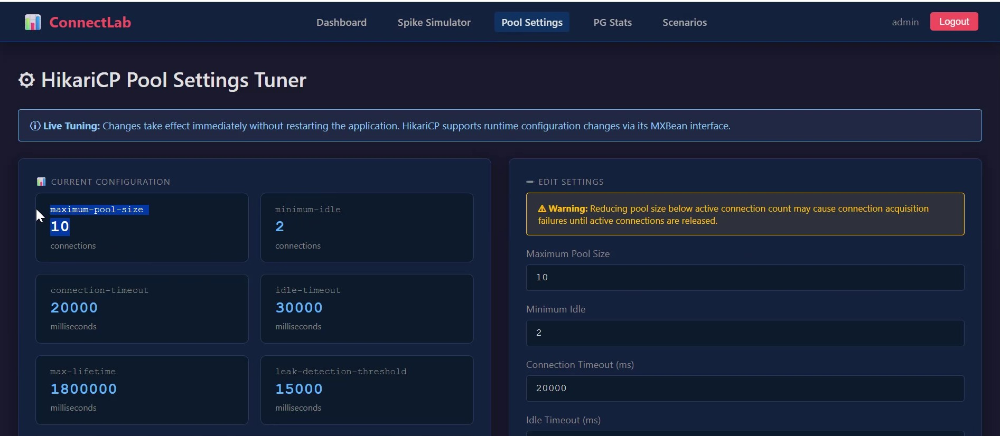
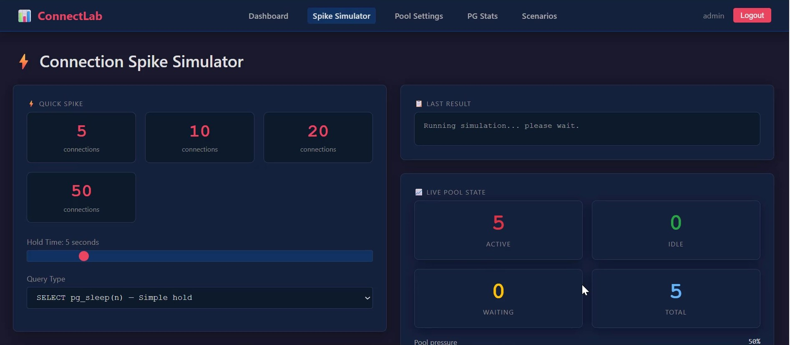
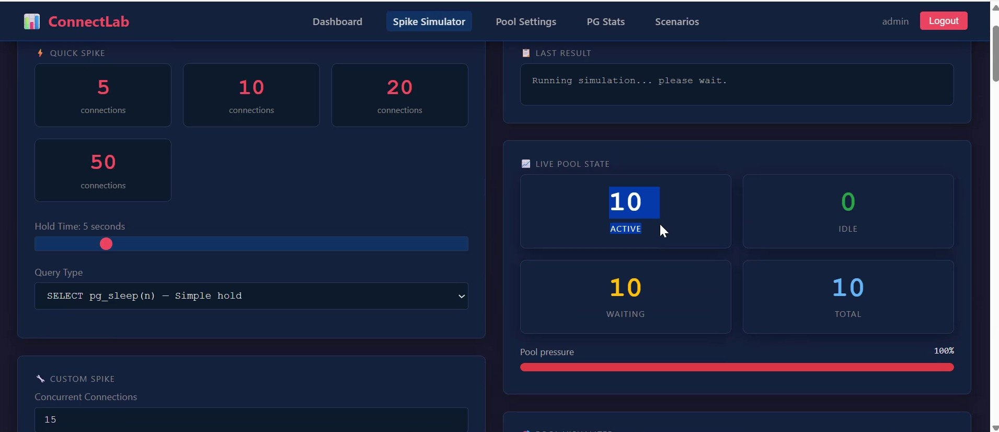

# PostgreSQL Connections, Processes & pgBouncer — Session Notes

This document captures key concepts from a live lab session covering PostgreSQL backend process architecture, connection management, pg_hba.conf rules, process states, timeout controls, safe process termination techniques, and a ConnectLab live demo showing HikariCP pool behavior under load. Each section includes actual terminal output observed during the session, followed by all questions discussed.

---

## Table of Contents

- [1. PostgreSQL Process Architecture](#1-postgresql-process-architecture)
- [2. pg\_hba.conf — Connection Filtering](#2-pg_hbaconf--connection-filtering)
- [3. kill -9 — Why It's a Crime](#3-kill--9--why-its-a-crime)
- [4. Safe Ways to Terminate Sessions](#4-safe-ways-to-terminate-sessions)
- [5. Backend Process States](#5-backend-process-states)
- [6. Session & Statement Timeout Controls](#6-session--statement-timeout-controls)
- [7. ConnectLab Live Demo — HikariCP Pool Behavior Under Load](#7-connectlab-live-demo--hikarcp-pool-behavior-under-load)
- [8. Summary of Error / Termination Messages](#8-summary-of-error--termination-messages)
- [9. Questions Discussed in This Session](#9-questions-discussed-in-this-session)

---

## 1. PostgreSQL Process Architecture

Every PostgreSQL instance runs a **postmaster** process that manages all background workers and spawns a new backend process for each client connection. With 100 direct connections, you get 100 backend processes.

```
/usr/pgsql-18/bin/postgres -D /u01/pgsql/18   ← postmaster (PID 5651)
```

Background processes spawned by the postmaster:

```
postgres    5652    5651   postgres: logger
postgres    5653    5651   postgres: io worker 0
postgres    5654    5651   postgres: io worker 1
postgres    5655    5651   postgres: io worker 2
postgres    5656    5651   postgres: checkpointer
postgres    5657    5651   postgres: background writer
postgres    5659    5651   postgres: walwriter
postgres    5660    5651   postgres: autovacuum launcher
postgres    5661    5651   postgres: logical replication launcher
```

Each background process has the postmaster as its parent (PPID = 5651).

---

## 2. pg_hba.conf — Connection Filtering

`pg_hba.conf` rules are evaluated **top to bottom**. The first matching rule wins.

```
# TYPE  DATABASE    USER   ADDRESS      METHOD
host    connectlab  all    0.0.0.0/0    reject
host    all         all    0.0.0.0/0    md5
```

Attempting to connect to `connectlab` from an external IP hits the first rule and is rejected before even reaching authentication:

```
psql: error: connection to server at "192.168.44.129", port 5432 failed:
FATAL:  pg_hba.conf rejects connection for host "192.168.44.129",
        user "postgres", database "connectlab", no encryption
```

The second rule (`md5` for all databases) never gets evaluated for `connectlab` because the `reject` rule matched first.

---

## 3. `kill -9` on a PostgreSQL Background Process — Why It's a Crime

Sending `SIGKILL` directly to any PostgreSQL background process bypasses PostgreSQL's internal shutdown protocol. The postmaster detects the abnormal exit, terminates all other active backends, and triggers crash recovery.

**Experiment: killing the background writer (PID 5657)**

```bash
kill -9 5657
```

**Postmaster log response:**

```
LOG:  background writer process (PID 5657) was terminated by signal 9: Killed
LOG:  terminating any other active server processes
LOG:  all server processes terminated; reinitializing
LOG:  database system was interrupted; last known up at 2026-03-20 07:23:37 IST
LOG:  database system was not properly shut down; automatic recovery in progress
LOG:  redo starts at 2/6DF1F260
LOG:  redo done at 2/6DF37CF8
LOG:  checkpoint complete: ...
LOG:  database system is ready to accept connections
```

Any session that was active at the time of the kill receives this warning and is terminated:

```
WARNING:  terminating connection because of crash of another server process
DETAIL:  The postmaster has commanded this server process to roll back the
         current transaction and exit, because another server process exited
         abnormally and possibly corrupted shared memory.
```

> ⚠️ PostgreSQL recovered automatically here, but in production this causes in-flight transaction rollbacks, potential shared memory corruption, and a full crash recovery cycle. **Never `kill -9` a PostgreSQL process.**

---

## 4. Safe Ways to Terminate Sessions

PostgreSQL provides two SQL functions for gracefully managing sessions without touching the OS.

### `pg_cancel_backend(pid)` — Cancel the current query, keep the connection

```sql
SELECT pg_cancel_backend('9948');
-- t

-- On the target session:
ERROR:  canceling statement due to user request
```

The session stays connected. Only the running query is cancelled.

### `pg_terminate_backend(pid)` — Disconnect the session entirely

```sql
SELECT pg_terminate_backend('9948');
-- t

-- On the target session:
FATAL:  terminating connection due to administrator command
-- Connection lost. Attempting reset: Succeeded.
```

The session is disconnected but PostgreSQL reconnects the client automatically (in `psql`). No crash recovery is triggered.

---

## 5. Backend Process States

Every backend visible in `ps -ef | grep postgres` is in one of these states (also visible in `pg_stat_activity`):

| State | Meaning |
|---|---|
| `idle` | Connected, not executing anything |
| `idle in transaction` | Inside an open transaction, waiting for next command |
| `active` | Currently executing a query |

---

## 6. Session & Statement Timeout Controls

All four timeout parameters default to `0` (disabled). They are set in `postgresql.conf` or at the session level.

```ini
statement_timeout                   = 0   # Kill query after N ms
transaction_timeout                 = 0   # Kill transaction after N ms
idle_in_transaction_session_timeout = 0   # Kill idle-in-transaction sessions
idle_session_timeout                = 0   # Kill idle sessions
```

### `idle_session_timeout` — Kills sessions sitting idle too long

```ini
idle_session_timeout = 5s
```

```
FATAL:  terminating connection due to idle-session timeout
-- Connection lost. Attempting reset: Succeeded.
```

### `idle_in_transaction_session_timeout` — Kills sessions holding open transactions

```ini
idle_in_transaction_session_timeout = 10s
```

```sql
UPDATE emp SET sal=200 WHERE id=1;
-- UPDATE 1
-- (10 seconds pass without COMMIT)
FATAL:  terminating connection due to idle-in-transaction timeout
```

> ⚠️ This is critical in production — an open transaction holds row-level locks and prevents autovacuum from cleaning dead tuples on affected tables.

---

## 7. ConnectLab Live Demo — HikariCP Pool Behavior Under Load

This section documents a live demo using **ConnectLab** (`connectlab-1.0.0.jar`) — a Spring Boot application that visualises HikariCP connection pool behaviour in real time. The goal was to prove, using `ps -ef` and HikariCP logs, exactly what PostgreSQL sees as pool pressure changes across the full lifecycle.

**Pool configuration used throughout this demo:**

| Parameter | Value |
|---|---|
| `maximum-pool-size` | **10** |
| `minimum-idle` | **2** |
| `connection-timeout` | 20000 ms |
| `idle-timeout` | **30000 ms** |
| `max-lifetime` | 1800000 ms |
| `leak-detection-threshold` | 15000 ms |

---


### 7.1 Phase 1 — App Started, No Load (`12:01`)

HikariCP opens exactly `minimum-idle = 2` connections on startup. Two backend processes appear in `ps`, both idle.

```bash
$ ps -ef | grep connectlab
postgres   42047   35533  0 12:01 ?   postgres: postgres connectlab 127.0.0.1(51540) idle
postgres   42050   35533  0 12:01 ?   postgres: postgres connectlab 127.0.0.1(51548) idle
```

HikariCP log — pool ramp-up (each `Added connection` = full TCP connect + pg_hba check + auth):

```
11:48:51 DEBUG [connection adder] HikariPool: ConnectLab-Pool - Added connection PgConnection@186fa1e6
11:48:51 DEBUG [connection adder] HikariPool: ConnectLab-Pool - Added connection PgConnection@16a84c9b
```

Only 2 physical connections established. PostgreSQL sees 2 backends.

---

### 7.2 Phase 2 — Spike Fired: 10 Concurrent Connections (`12:01`)

Spike Simulator fires 10 threads simultaneously. HikariCP grows the pool from 2 → 10 on demand, creating 8 new physical connections while the 2 warm connections are borrowed immediately.

**`ps` during spike — all 10 backends showing `SELECT`:**

```bash
$ ps -ef | grep connectlab
postgres   42010    3686 56 12:01 pts/1   java -jar connectlab-1.0.0.jar
postgres   42047   35533  0 12:01 ?       postgres: postgres connectlab 127.0.0.1(51540) SELECT  ← warm, reused
postgres   42050   35533  0 12:01 ?       postgres: postgres connectlab 127.0.0.1(51548) SELECT  ← warm, reused
postgres   42131   35533  0 12:01 ?       postgres: postgres connectlab 127.0.0.1(45962) SELECT  ← new auth
postgres   42132   35533  0 12:01 ?       postgres: postgres connectlab 127.0.0.1(45976) SELECT  ← new auth
postgres   42133   35533  0 12:01 ?       postgres: postgres connectlab 127.0.0.1(45986) SELECT  ← new auth
postgres   42134   35533  0 12:01 ?       postgres: postgres connectlab 127.0.0.1(45988) SELECT  ← new auth
postgres   42135   35533  0 12:01 ?       postgres: postgres connectlab 127.0.0.1(45992) SELECT  ← new auth
postgres   42136   35533  0 12:01 ?       postgres: postgres connectlab 127.0.0.1(45994) SELECT  ← new auth
postgres   42137   35533  0 12:01 ?       postgres: postgres connectlab 127.0.0.1(46004) SELECT  ← new auth
postgres   42138   35533  0 12:01 ?       postgres: postgres connectlab 127.0.0.1(46010) SELECT  ← new auth
```



HikariCP log — pool growing, connections acquired (note wait times increase as pool builds):

```
11:48:51 DEBUG [connection adder] HikariPool: ConnectLab-Pool - Added connection PgConnection@3ba0820d
11:48:51 INFO  [pool-2-thread-2]  ConnectionEventListener: [CONNECTION_ACQUIRED] conn=spike-2  waited=16ms
11:48:51 INFO  [pool-2-thread-10] ConnectionEventListener: [CONNECTION_ACQUIRED] conn=spike-10 waited=0ms   ← already warm
11:48:51 INFO  [pool-2-thread-1]  ConnectionEventListener: [CONNECTION_ACQUIRED] conn=spike-1  waited=5ms
11:48:51 DEBUG [connection adder] HikariPool: ConnectLab-Pool - Added connection PgConnection@1297ca96
11:48:51 INFO  [pool-2-thread-4]  ConnectionEventListener: [CONNECTION_ACQUIRED] conn=spike-4  waited=30ms
11:48:51 DEBUG [connection adder] HikariPool: ConnectLab-Pool - Added connection PgConnection@579546a0
11:48:51 INFO  [pool-2-thread-5]  ConnectionEventListener: [CONNECTION_ACQUIRED] conn=spike-5  waited=33ms
11:48:51 DEBUG [connection adder] HikariPool: ConnectLab-Pool - Added connection PgConnection@3210bd25
11:48:51 INFO  [pool-2-thread-6]  ConnectionEventListener: [CONNECTION_ACQUIRED] conn=spike-6  waited=40ms
11:48:51 DEBUG [connection adder] HikariPool: ConnectLab-Pool - Added connection PgConnection@6688f368
11:48:51 INFO  [pool-2-thread-7]  ConnectionEventListener: [CONNECTION_ACQUIRED] conn=spike-7  waited=46ms
11:48:51 DEBUG [connection adder] HikariPool: ConnectLab-Pool - Added connection PgConnection@4ae75655
11:48:51 INFO  [pool-2-thread-8]  ConnectionEventListener: [CONNECTION_ACQUIRED] conn=spike-8  waited=57ms
11:48:51 INFO  [pool-2-thread-9]  ConnectionEventListener: [CONNECTION_ACQUIRED] conn=spike-9  waited=68ms
11:48:51 INFO  [pool-2-thread-3]  ConnectionEventListener: [CONNECTION_ACQUIRED] conn=spike-3  waited=87ms
```

Notice `spike-10` waited `0ms` — it grabbed one of the 2 warm connections instantly with no auth. Threads 3–9 waited progressively longer because the `connection adder` thread was creating new physical connections to PostgreSQL one by one during the spike.

---

### 7.3 Phase 3 — Spike Ends, Before idleTimeout (`12:01–12:02`)

All 10 threads finish and return connections to the pool. `ps` still shows 10 backends — all flipped back to `idle`. No connections closed yet because `idle-timeout = 30000ms` has not elapsed.

**`ps` after spike, before timeout:**

```bash
$ ps -ef | grep connectlab
postgres   42010    3686 42 12:01 pts/1   java -jar connectlab-1.0.0.jar
postgres   42047   35533  0 12:01 ?       postgres: postgres connectlab 127.0.0.1(51540) idle
postgres   42050   35533  0 12:01 ?       postgres: postgres connectlab 127.0.0.1(51548) idle
postgres   42131   35533  0 12:01 ?       postgres: postgres connectlab 127.0.0.1(45962) idle
postgres   42132   35533  0 12:01 ?       postgres: postgres connectlab 127.0.0.1(45976) idle
postgres   42133   35533  0 12:01 ?       postgres: postgres connectlab 127.0.0.1(45986) idle
postgres   42134   35533  0 12:01 ?       postgres: postgres connectlab 127.0.0.1(45988) idle
postgres   42135   35533  0 12:01 ?       postgres: postgres connectlab 127.0.0.1(45992) idle
postgres   42136   35533  0 12:01 ?       postgres: postgres connectlab 127.0.0.1(45994) idle
postgres   42137   35533  0 12:01 ?       postgres: postgres connectlab 127.0.0.1(46004) idle
postgres   42138   35533  0 12:01 ?       postgres: postgres connectlab 127.0.0.1(46010) idle
```

HikariCP log — all connections returned at exactly `11:48:56` (held 5000ms = 5s hold time):

```
11:48:56 INFO [pool-2-thread-2]  ConnectionEventListener: [CONNECTION_RETURNED] conn=spike-2  held=5000ms
11:48:56 INFO [pool-2-thread-10] ConnectionEventListener: [CONNECTION_RETURNED] conn=spike-10 held=5000ms
11:48:56 INFO [pool-2-thread-1]  ConnectionEventListener: [CONNECTION_RETURNED] conn=spike-1  held=5000ms
11:48:56 INFO [pool-2-thread-4]  ConnectionEventListener: [CONNECTION_RETURNED] conn=spike-4  held=5000ms
11:48:56 INFO [pool-2-thread-5]  ConnectionEventListener: [CONNECTION_RETURNED] conn=spike-5  held=5000ms
11:48:56 INFO [pool-2-thread-6]  ConnectionEventListener: [CONNECTION_RETURNED] conn=spike-6  held=5000ms
11:48:56 INFO [pool-2-thread-7]  ConnectionEventListener: [CONNECTION_RETURNED] conn=spike-7  held=5000ms
11:48:56 INFO [pool-2-thread-8]  ConnectionEventListener: [CONNECTION_RETURNED] conn=spike-8  held=5000ms
11:48:56 INFO [pool-2-thread-9]  ConnectionEventListener: [CONNECTION_RETURNED] conn=spike-9  held=5000ms
11:48:56 INFO [pool-2-thread-3]  ConnectionEventListener: [CONNECTION_RETURNED] conn=spike-3  held=5000ms
```

HikariCP housekeeper first pass at `11:49:04` (~8 seconds after spike) — `idleTimeout` not elapsed yet, nothing evicted:

```
11:49:04 DEBUG [pool housekeeper] HikariPool: ConnectLab-Pool - Before cleanup stats (total=10, active=0, idle=10, waiting=0)
11:49:04 DEBUG [pool housekeeper] HikariPool: ConnectLab-Pool - After cleanup  stats (total=10, active=0, idle=10, waiting=0)
11:49:04 DEBUG [pool housekeeper] HikariPool: ConnectLab-Pool - Fill pool skipped, pool is at sufficient level.
```

All 10 backends survive. `ps` count unchanged.

---

### 7.4 Phase 4 — After idleTimeout (`12:02`)

HikariCP housekeeper runs again at `11:49:34` — exactly 30 seconds after connections were returned. `idle-timeout = 30000ms` has elapsed. 8 connections are closed, pool shrinks back to `minimum-idle = 2`.

**`ps` after timeout:**

```bash
$ ps -ef | grep connectlab
postgres   42010    3686 27 12:01 pts/1   java -jar connectlab-1.0.0.jar
postgres   42047   35533  0 12:01 ?       postgres: postgres connectlab 127.0.0.1(51540) idle  ← SURVIVED
postgres   42050   35533  0 12:01 ?       postgres: postgres connectlab 127.0.0.1(51548) idle  ← SURVIVED
```

PIDs 42047 and 42050 are the **exact same two backends from Phase 1** — same PID, same port. They were the original `minimum-idle` connections and survived eviction. PIDs 42131–42138 (the spike backends) are gone.

HikariCP housekeeper second pass — eviction in action:

```
11:49:34 DEBUG [pool housekeeper] HikariPool: ConnectLab-Pool - Before cleanup stats (total=10, active=0, idle=10, waiting=0)
11:49:34 DEBUG [pool housekeeper] HikariPool: ConnectLab-Pool - After cleanup  stats (total=2,  active=0, idle=2,  waiting=0)

11:49:34 DEBUG [connection closer] PoolBase: ConnectLab-Pool - Closing connection PgConnection@4ae75655: (connection has passed idleTimeout)
11:49:34 DEBUG [connection closer] PoolBase: ConnectLab-Pool - Closing connection PgConnection@6688f368: (connection has passed idleTimeout)
11:49:34 DEBUG [connection closer] PoolBase: ConnectLab-Pool - Closing connection PgConnection@3210bd25: (connection has passed idleTimeout)
11:49:34 DEBUG [connection closer] PoolBase: ConnectLab-Pool - Closing connection PgConnection@579546a0: (connection has passed idleTimeout)
11:49:34 DEBUG [connection closer] PoolBase: ConnectLab-Pool - Closing connection PgConnection@1297ca96: (connection has passed idleTimeout)
11:49:34 DEBUG [connection closer] PoolBase: ConnectLab-Pool - Closing connection PgConnection@3ba0820d: (connection has passed idleTimeout)
11:49:34 DEBUG [connection closer] PoolBase: ConnectLab-Pool - Closing connection PgConnection@16a84c9b: (connection has passed idleTimeout)
11:49:34 DEBUG [connection closer] PoolBase: ConnectLab-Pool - Closing connection PgConnection@186fa1e6: (connection has passed idleTimeout)
```

8 backend processes exit. PostgreSQL is back to 2 backends.

---

### 7.5 Complete Timeline

| Timestamp | Event | `ps` backend count | HikariCP pool state |
|---|---|---|---|
| `12:01` startup | App starts, minimum-idle opens | **2** | total=2, idle=2 |
| `11:48:51` | Spike fired, pool grows to 10 | **10** | total=10, active=10 |
| `11:48:56` | Spike ends, all connections returned | **10** | total=10, idle=10 |
| `11:49:04` | Housekeeper pass 1 — timeout not elapsed | **10** | total=10, idle=10 |
| `11:49:34` | Housekeeper pass 2 — idleTimeout elapsed | **2** | total=2, idle=2 |

---

### 7.6 Key Takeaway

> Idle backends do **not** disappear on their own from PostgreSQL's side. They disappear when the **application pool** (HikariCP `idleTimeout`, pgBouncer `server_idle_timeout`) decides to close them. PostgreSQL is passive — it only reacts when the client closes the connection.

```
spike ends
    │
    ├── connections returned to HikariCP pool
    │       └── backends flip: SELECT → idle  (still in ps)
    │
    ├── idleTimeout not elapsed → backends stay (ps count unchanged)
    │
    └── idleTimeout elapsed → HikariCP closes 8 connections
            └── 8 backend processes exit  (ps count drops to minimum-idle)
```

---

### 7.7 Heavy Spike: 20 Connections Against pool_size=10

**Spike Simulator fired with 20 connections, same hold time and query.**

**Live Pool State:**

| Metric | Value |
|---|---|
| ACTIVE | **10** |
| IDLE | 0 |
| WAITING | **10** |
| TOTAL | 10 |
| Pool Pressure | **100%** 🔴 |

Pool is fully saturated. The 10 excess threads are **blocked inside HikariCP** waiting for a connection to free up — PostgreSQL never saw them.



**`ps -ef` captured during this spike:**

```
postgres   35649   35533   0 11:22 ?   postgres: postgres connectlab 127.0.0.1(55728) SELECT
postgres   35650   35533   0 11:22 ?   postgres: postgres connectlab 127.0.0.1(55738) SELECT
postgres   35651   35533   0 11:22 ?   postgres: postgres connectlab 127.0.0.1(55750) SELECT
postgres   35669   35533   0 11:22 ?   postgres: postgres connectlab 127.0.0.1(52918) SELECT
postgres   35670   35533   0 11:22 ?   postgres: postgres connectlab 127.0.0.1(52930) SELECT
postgres   35674   35533   0 11:22 ?   postgres: postgres connectlab 127.0.0.1(57846) SELECT
postgres   35675   35533   0 11:22 ?   postgres: postgres connectlab 127.0.0.1(57860) SELECT
postgres   35704   35533   0 11:22 ?   postgres: postgres connectlab 127.0.0.1(57862) SELECT
postgres   35710   35533   0 11:22 ?   postgres: postgres connectlab 127.0.0.1(57864) SELECT
postgres   35711   35533   0 11:22 ?   postgres: postgres connectlab 127.0.0.1(57870) SELECT
```

**Exactly 10 backend processes** — matching `maximum-pool-size`. The other 10 threads waiting in HikariCP are invisible to PostgreSQL entirely.

---

### 7.5 Step 4 — After Spike Settles

```
postgres   35649   35533   0 11:22 ?   postgres: postgres connectlab 127.0.0.1(55728) idle
postgres   35650   35533   0 11:22 ?   postgres: postgres connectlab 127.0.0.1(55738) idle
postgres   35651   35533   0 11:22 ?   postgres: postgres connectlab 127.0.0.1(55750) idle
postgres   35669   35533   0 11:22 ?   postgres: postgres connectlab 127.0.0.1(52918) idle
postgres   35670   35533   0 11:22 ?   postgres: postgres connectlab 127.0.0.1(52930) SELECT
postgres   35674   35533   0 11:22 ?   postgres: postgres connectlab 127.0.0.1(57846) idle
postgres   35675   35533   0 11:22 ?   postgres: postgres connectlab 127.0.0.1(57860) idle
```

Load subsided. Same 10 backends, most back to `idle` — HikariCP is holding them open (minimum-idle pool behaviour). One backend still shows `SELECT` mid-execution. No new processes were created, none were destroyed.

---

## 8. pgbench — Direct vs pgBouncer Comparison

800 clients, 1 transaction each, TPC-B workload, `SELECT pg_sleep(n)` query type.

### Direct to PostgreSQL (port 5432)

```bash
$ pgbench -c 800 -t 1 -d connectlab -U postgres -h localhost -p 5432

transaction type: <builtin: TPC-B (sort of)>
scaling factor: 10
number of clients: 800
number of threads: 1
number of transactions actually processed: 800/800
number of failed transactions: 0 (0.000%)
latency average                = 3198.441 ms
initial connection time        = 3967.466 ms
tps                            = 250.121856 (without initial connection time)
```

### Via pgBouncer (port 6432)

```bash
$ pgbench -c 800 -t 1 -d connectlab -U postgres -h localhost -p 6432

transaction type: <builtin: TPC-B (sort of)>
scaling factor: 10
number of clients: 800
number of threads: 1
number of transactions actually processed: 800/800
number of failed transactions: 0 (0.000%)
latency average                = 1588.350 ms
initial connection time        = 7837.869 ms
tps                            = 503.667328 (without initial connection time)
```

### Side-by-Side Analysis

| Metric | Direct (5432) | pgBouncer (6432) | Difference |
|---|---|---|---|
| TPS | 250 | **503** | **2× higher** |
| Latency avg | 3198 ms | **1588 ms** | **2× lower** |
| Initial connection time | **3967 ms** | 7837 ms | pgBouncer slower |
| Failed transactions | 0 | 0 | — |

### Why TPS doubled and latency halved

**Direct path:** PostgreSQL had to fork 800 backend processes simultaneously. Process creation (`fork()`) is expensive. With 800 processes all competing for CPU, shared memory, and I/O at the same time, the OS scheduler thrashed. Each process held a lock slot, scanned the ProcArray, and competed for buffer pool access. All 800 processes ran concurrently — this is the core problem PostgreSQL's process model creates at high concurrency.

**pgBouncer path:** pgBouncer accepted 800 client connections but only forwarded `pool_size` worth of work to PostgreSQL at a time. The rest queued inside pgBouncer — lightweight, no PostgreSQL resources consumed. PostgreSQL never saw 800 concurrent backends. It saw only `pool_size` backends doing real work in a tight loop, finishing transactions quickly and picking up the next queued client. Less contention, higher throughput.

### Why initial connection time was higher via pgBouncer

This surprises students. Direct connect to PostgreSQL: pgbench opens 800 TCP connections straight to PostgreSQL — fast, because there is no intermediary. Via pgBouncer: pgbench opens 800 connections to pgBouncer, pgBouncer authenticates each one, then pgBouncer opens `pool_size` connections to PostgreSQL and starts multiplexing. Two layers of handshaking = higher initial connection time.

But this is a **one-time cost**. In production, the application opens connections once at startup and reuses them. The initial connection time is irrelevant to steady-state throughput.

### The real-world implication

> pgBouncer's value is not just raw TPS — it is protecting PostgreSQL from connection storms. With direct connections, 800 clients = 800 backend processes = OS-level thrashing. With pgBouncer, 800 clients = `pool_size` backends = controlled, predictable execution. The pgbench numbers are proof, not just theory.

---

## 9. Summary of Error / Termination Messages

| Message | Trigger |
|---|---|
| `ERROR: canceling statement due to user request` | `pg_cancel_backend()` |
| `FATAL: terminating connection due to administrator command` | `pg_terminate_backend()` |
| `WARNING: terminating connection because of crash of another server process` | `kill -9` on any backend |
| `FATAL: terminating connection due to idle-session timeout` | `idle_session_timeout` exceeded |
| `FATAL: terminating connection due to idle-in-transaction timeout` | `idle_in_transaction_session_timeout` exceeded |

---

## 10. Questions Discussed in This Session

**Q1. Every session creates a new process — so 100 connections = 100 processes in `ps`?**

Yes. PostgreSQL uses a process-per-connection model. Each client connection forks a new backend process from the postmaster. This is why connection pooling exists.

---

**Q2. If pgBouncer is in session mode, does `ps` show `pool_size` backends forever?**

Not forever. The ConnectLab demo showed this directly — backends persist as long as the pool holds the connections, then disappear when `idleTimeout` (HikariCP) or `server_idle_timeout` (pgBouncer) elapses.

From the demo:
- At `11:48:56` all 10 connections were returned to the pool → 10 backends still in `ps`
- At `11:49:34` (30 seconds later) `idleTimeout` elapsed → 8 backends closed → `ps` dropped to 2

`pool_size` is the ceiling — you will never see more backends than that regardless of how many clients connect. But "forever" only holds if `idleTimeout = 0` (disabled).

---

**Q3. Those idle backends in `ps` — will they go away on their own?**

Only if the **pool's idleTimeout** is configured. The demo showed three distinct states:

| State | `ps` count | Why |
|---|---|---|
| Spike active | 10 | Pool fully saturated |
| Spike ended, timeout not elapsed | 10 | HikariCP holding connections idle |
| After `idleTimeout = 30s` elapsed | **2** | HikariCP evicted 8, kept `minimum-idle` |

With `idleTimeout = 0` in HikariCP or `server_idle_timeout = 0` in pgBouncer, the housekeeper never evicts — those backends sit indefinitely. PostgreSQL's own `idle_session_timeout` is a separate safety net but is also `0` by default.

---

**Q4. What does `tcp_keepalives_idle = 0` mean in PostgreSQL, and when does TCP keepalive actually matter?**

`tcp_keepalives_idle = 0` means PostgreSQL defers to the OS default — on Linux that is `7200` seconds (`/proc/sys/net/ipv4/tcp_keepalive_time`). A dead client connection won't be detected for approximately 2 hours 11 minutes.

However, TCP keepalive never triggered in the ConnectLab demo because HikariCP was alive and closed connections cleanly via `idleTimeout`. TCP keepalive only matters when the **client process dies silently** — OOM kill, machine crash, firewall drop — without closing the TCP connection. In that scenario PostgreSQL is left holding a backend for a dead client and won't know until the keepalive probe fails. For live idle connections (which is what the demo showed), TCP keepalive does nothing.

---

**Q5. If HikariCP pool is set to 20, does the 21st request get blocked at the client level?**

Yes — exactly. The 21st thread blocks inside HikariCP waiting for a connection to free up, controlled by `connectionTimeout` (default 30 seconds). PostgreSQL never sees it at all. The ConnectLab spike demo proved this live — `ps` showed exactly 10 backends while any threads beyond `pool_size` waited silently inside Java.

---

**Q6. Does having 50 idle sessions sitting in `ps` hurt performance?**

No — memory is approximately 1.9 MB per backend, so 50 idle sessions is around 95 MB total, which is negligible. The only secondary effect is that each backend occupies a slot in PostgreSQL's ProcArray, which is scanned during snapshot acquisition for MVCC. At 50 backends this overhead is immeasurable; it only becomes relevant above ~500 connections.

---

**Q7. With pgBouncer `pool_size=10` and two databases configured, do I get 10 shared connections or 20 total?**

20 total. `pool_size` applies **per (database, user) pair**. Each unique combination gets its own independent pool. Verify live with:

```sql
psql -p 6432 pgbouncer -c "SHOW POOLS"
```

---

**Q8. pgbench showed TPS doubled and latency halved through pgBouncer, but initial connection time was higher — why?**

See [Section 8](#8-pgbench--direct-vs-pgbouncer-comparison) for the full breakdown with actual numbers.

In short: pgBouncer's higher initial connection time is because pgbench must handshake with pgBouncer first, then pgBouncer handshakes with PostgreSQL — two layers vs one. But this is a one-time startup cost. The TPS and latency numbers reflect steady-state execution, where pgBouncer's connection multiplexing eliminates the 800-process thrash that hit PostgreSQL directly. TPS doubled (`250 → 503`) and latency halved (`3198ms → 1588ms`) because PostgreSQL was serving `pool_size` backends efficiently instead of 800 competing processes simultaneously.
